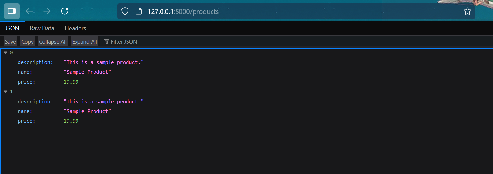

A simple REST API to manage a product resource

procedure to run:
Open the terminal and run the following:
- pip install Flask
- pip intall Flask requests
- python app.py 

Once step 3 is run, the line 
"WARNING: This is a development server. Do not use it in a production deployment. Use a production WSGI server instead.
 * Running on http://127.0.0.1:5000"

 Will appear. Hover on the link provided and press "follow link" (Ensure your flask server is running)

 To create a retrieve products, run:
 python client.py

 DOCUMENTATION:
 when the API is run:
 